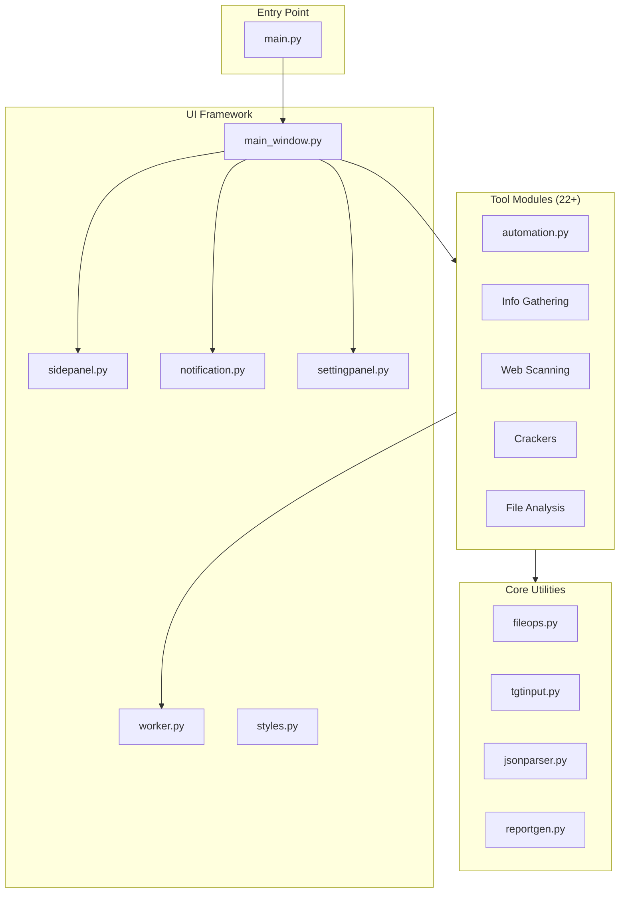
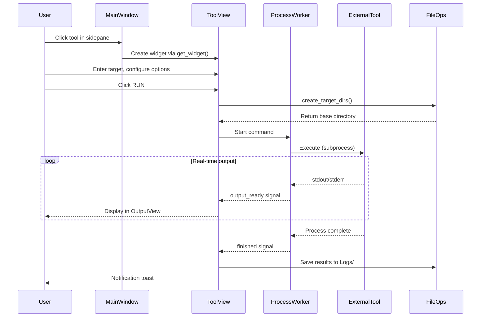

# VAJRA Offensive Security Platform - Architecture Walkthrough

## Executive Summary

**VAJRA (Versatile Automated Jailbreak and Reconnaissance Arsenal)** is a professional-grade offensive security platform that integrates 22+ penetration testing tools into a modern, modular GUI built with PySide6. The platform follows a plugin-based architecture with consistent design patterns across all modules.

---

## Project Structure



---

## Core Design Principles

| Principle | Implementation |
|-----------|----------------|
| **Plugin Architecture** | All tools inherit from `ToolBase` abstract class with auto-discovery |
| **Non-blocking UI** | `ProcessWorker` (QThread) executes external commands asynchronously |
| **Consistent Theming** | Centralized VS Code Dark+ inspired stylesheet in `styles.py` |
| **Organized Output** | Timestamped directory structure in `/tmp/Vajra-results/` |
| **Privilege Management** | `PrivilegeManager` handles sudo/pkexec for elevated commands |
| **Toast Notifications** | `NotificationManager` provides real-time user feedback |

---

## Core Components (`core/`)

### [fileops.py](file:///e:/VAJRA---Offensive-Security-Platform/core/fileops.py)

Manages result directory structure:

- **Base Path**: `/tmp/Vajra-results/`
- **Structure**: `<target>_<timestamp>/Logs/`, `Reports/`, `JSON/`
- Key function: `create_target_dirs(target_name, group_file)`

### [tgtinput.py](file:///e:/VAJRA---Offensive-Security-Platform/core/tgtinput.py)

Reusable `TargetInput` widget providing:

- Single target text input (domain, IP, CIDR)
- File-based multi-target input with file dialog
- `normalize_target()` - Strips protocols (http/https)
- `parse_targets()` - Handles both single and file inputs

### [jsonparser.py](file:///e:/VAJRA---Offensive-Security-Platform/core/jsonparser.py)

`FinalJsonGenerator` class consolidates scan outputs:

- Parses Whois, Subdomains, Nmap XML logs
- Creates structured `final.json` for reporting
- Provides basic security recommendations

### [reportgen.py](file:///e:/VAJRA---Offensive-Security-Platform/core/reportgen.py)

`ReportGenerator` creates styled HTML reports:

- Interactive sections with toggle visibility
- Copy buttons, fixed header/sidebar
- PDF export via `window.print()`

---

## UI Framework (`ui/`)

### [main_window.py](file:///e:/VAJRA---Offensive-Security-Platform/ui/main_window.py)

Central `MainWindow` class:

- **Tool Discovery**: Dynamically imports all modules from `modules/` directory
- **Tab Management**: Each tool opens in its own tab
- **Graceful Shutdown**: Stops all active processes on close

### [sidepanel.py](file:///e:/VAJRA---Offensive-Security-Platform/ui/sidepanel.py)

Collapsible navigation with categorized tool buttons using `ToolCategory` enum:

- `INFO_GATHERING`, `WEB_SCANNING`, `WEB_SCREENSHOTS`
- `CRACKER`, `FILE_ANALYSIS`, `AUTOMATION`

### [worker.py](file:///e:/VAJRA---Offensive-Security-Platform/ui/worker.py)

Background execution infrastructure:

- **`ProcessWorker`**: QThread for non-blocking command execution
- **`StoppableToolMixin`**: Mixin for widgets to manage/stop workers
- Graceful termination (SIGTERM → SIGKILL after timeout)

### [notification.py](file:///e:/VAJRA---Offensive-Security-Platform/ui/notification.py)

Notification system:

- `ToastNotification`: Auto-hiding popup messages
- `NotificationPanel`: Persistent message list
- `NotificationManager`: Central coordinator

### [settingpanel.py](file:///e:/VAJRA---Offensive-Security-Platform/ui/settingpanel.py)

Application settings including `PrivilegeManager`:

- Sudo password storage (in-memory only)
- `pkexec`/`sudo` command wrapping
- Global `privilege_manager` instance

### [styles.py](file:///e:/VAJRA---Offensive-Security-Platform/ui/styles.py)

Centralized styling (773 lines):

- **Color Palette**: VS Code Dark+ theme colors
- **Custom Widgets**: `BaseToolView`, `CopyButton`, `OutputView`, `StyledSpinBox`, `CommandDisplay`
- **Consistent Stylesheets**: Input fields, buttons, panels

---

## Tool Plugin System

### Base Class ([bases.py](file:///e:/VAJRA---Offensive-Security-Platform/modules/bases.py))

```python
class ToolCategory(Enum):
    INFO_GATHERING = "Info Gathering"
    WEB_SCANNING = "Web Scanning"
    WEB_SCREENSHOTS = "Web Screenshots"
    CRACKER = "Cracker"
    FILE_ANALYSIS = "File Analysis"
    AUTOMATION = "Automation"

class ToolBase(ABC):
    @property
    @abstractmethod
    def name(self) -> str: ...
    
    @property
    @abstractmethod
    def category(self) -> ToolCategory: ...
    
    @abstractmethod
    def get_widget(self, main_window) -> QWidget: ...
```

### Tool Implementation Pattern

All tools follow a consistent pattern:

1. **Tool Class**: Inherits `ToolBase`, implements `name`, `category`, `get_widget()`
2. **View Class**: Inherits `BaseToolView` or `QWidget` + `StoppableToolMixin`
3. **UI Structure**: Target input, options, command preview, run/stop buttons, output area
4. **Execution**: Uses `ProcessWorker` for external command execution
5. **Output Handling**: Real-time streaming with color-coded formatting

---

## Integrated Tools (22 Total)

### Information Gathering (6 tools)

| Tool | File | External Binary | Purpose |
|------|------|-----------------|---------|
| **Whois** | [whois.py](file:///e:/VAJRA---Offensive-Security-Platform/modules/whois.py) | `whois` | Domain registration lookup |
| **Dig** | [dig.py](file:///e:/VAJRA---Offensive-Security-Platform/modules/dig.py) | `dig` | DNS queries (A, MX, NS, AXFR, +trace) |
| **DNSRecon** | [dnsrecon.py](file:///e:/VAJRA---Offensive-Security-Platform/modules/dnsrecon.py) | `dnsrecon` | Advanced DNS enumeration |
| **Subfinder** | [subfinder.py](file:///e:/VAJRA---Offensive-Security-Platform/modules/subfinder.py) | `subfinder` | Subdomain discovery |
| **Amass** | [amass.py](file:///e:/VAJRA---Offensive-Security-Platform/modules/amass.py) | `amass` | Subdomain enumeration (enum/intel modes) |
| **WAFW00F** | [wafw00f.py](file:///e:/VAJRA---Offensive-Security-Platform/modules/wafw00f.py) | `wafw00f` | WAF detection with custom signature engine |

### Network Scanning (3 tools)

| Tool | File | External Binary | Purpose |
|------|------|-----------------|---------|
| **Nmap** | [nmap.py](file:///e:/VAJRA---Offensive-Security-Platform/modules/nmap.py) | `nmap` | Comprehensive network scanner |
| **Port Scanner** | [portscanner.py](file:///e:/VAJRA---Offensive-Security-Platform/modules/portscanner.py) | Built-in Python | Custom scanner (connect/SYN/UDP, OS detection) |
| **HTTPX** | [httpx.py](file:///e:/VAJRA---Offensive-Security-Platform/modules/httpx.py) | `httpx` | HTTP(S) probing |

### Web Scanning (5 tools)

| Tool | File | External Binary | Purpose |
|------|------|-----------------|---------|
| **Gobuster** | [gobuster.py](file:///e:/VAJRA---Offensive-Security-Platform/modules/gobuster.py) | `gobuster` | Dir/DNS/VHost/Fuzz/S3 brute-forcing |
| **FFUF** | [ffuf.py](file:///e:/VAJRA---Offensive-Security-Platform/modules/ffuf.py) | `ffuf` | Web fuzzer with advanced filtering |
| **Nikto** | [nikto.py](file:///e:/VAJRA---Offensive-Security-Platform/modules/nikto.py) | `nikto` | Web server vulnerability scanning |
| **Nuclei** | [nuclei.py](file:///e:/VAJRA---Offensive-Security-Platform/modules/nuclei.py) | `nuclei` | Template-based vuln scanning |
| **SearchSploit** | [searchsploit.py](file:///e:/VAJRA---Offensive-Security-Platform/modules/searchsploit.py) | `searchsploit` | Exploit-DB search |

### Web Screenshots (1 tool)

| Tool | File | External Binary | Purpose |
|------|------|-----------------|---------|
| **Eyewitness** | [eyewitness.py](file:///e:/VAJRA---Offensive-Security-Platform/modules/eyewitness.py) | `eyewitness` | Web screenshot capture |

### Password Cracking (5 tools)

| Tool | File | External Binary | Purpose |
|------|------|-----------------|---------|
| **Hashcat** | [hashcat.py](file:///e:/VAJRA---Offensive-Security-Platform/modules/hashcat.py) | `hashcat` | GPU/CPU hash cracking (180+ types) |
| **John The Ripper** | [john.py](file:///e:/VAJRA---Offensive-Security-Platform/modules/john.py) | `john` | Password cracker (200+ formats) |
| **Hydra** | [hydra.py](file:///e:/VAJRA---Offensive-Security-Platform/modules/hydra.py) | `hydra` | Network service brute-forcing |
| **Hash Finder** | [hashfinder.py](file:///e:/VAJRA---Offensive-Security-Platform/modules/hashfinder.py) | Built-in | Hash type identification (200+ types) |
| **Dencoder** | [dencoder.py](file:///e:/VAJRA---Offensive-Security-Platform/modules/dencoder.py) | Built-in | Encode/decode (60+ operations) |

### File Analysis (1 tool)

| Tool | File | External Binary | Purpose |
|------|------|-----------------|---------|
| **Strings** | [strings.py](file:///e:/VAJRA---Offensive-Security-Platform/modules/strings.py) | Built-in | Binary string extraction with pattern detection |

### Automation (1 tool)

| Tool | File | Purpose |
|------|------|---------|
| **Automation** | [automation.py](file:///e:/VAJRA---Offensive-Security-Platform/modules/automation.py) | Sequential pipeline: Whois → Subfinder → Amass → Httpx → Nmap → Report |

---

## Data Flow Architecture



---

## Notable Implementation Details

### Privilege Escalation

Tools requiring root (Nmap SYN scan, Amass) use `PrivilegeManager`:

```python
# In settingpanel.py
class PrivilegeManager:
    def wrap_command(self, cmd_list):
        if self._sudo_enabled and self._password:
            return ['sudo', '-S'] + cmd_list
        return cmd_list
```

### WAF Detection Engine

[wafw00f.py](file:///e:/VAJRA---Offensive-Security-Platform/modules/wafw00f.py) includes `SmartWAFDetector`:

- 14 known WAF signature patterns (Cloudflare, Akamai, AWS, etc.)
- XSS/SQLi payloads to trigger WAF blocks
- Header, cookie, status code, and body analysis

### Hash Identification

[hashfinder.py](file:///e:/VAJRA---Offensive-Security-Platform/modules/hashfinder.py) implements `HashIdentifier`:

- 200+ hash types recognized
- Prefix pattern matching ($2a$, $argon2, $6$, etc.)
- Length-based identification (32=MD5/NTLM, 64=SHA256, 128=SHA512)

### String Extraction

[strings.py](file:///e:/VAJRA---Offensive-Security-Platform/modules/strings.py) provides:

- Multi-encoding support (ASCII, UTF-16LE/BE, UTF-8)
- Pattern detection (URLs, IPs, emails, paths, registry keys, Base64, crypto keywords)
- Hex offset display and context view

---

## Build & Deployment

### Linux Build Scripts ([linux_setup/](file:///e:/VAJRA---Offensive-Security-Platform/linux_setup))

| Script | Tool | Purpose |
|--------|------|---------|
| `build_linux.sh` | PyInstaller | Single-file executable (fast build) |
| `build_nuitka.sh` | Nuitka | C++ compiled (better protection) |
| `install.sh` | N/A | Desktop shortcut creation |

### Dependencies ([requirements.txt](file:///e:/VAJRA---Offensive-Security-Platform/requirements.txt))

```
PySide6>=6.7.0
pyinstaller
```

---

## Output Structure

```
/tmp/Vajra-results/
└── target.com_01012024_120000/
    ├── Logs/
    │   ├── whois.txt
    │   ├── dig.txt
    │   ├── nmap.xml
    │   ├── gobuster_dir.txt
    │   └── ...
    ├── Subdomains/
    │   ├── subfinder.txt
    │   └── amass.txt
    ├── Httpx/
    │   └── httpx.json
    ├── Reports/
    │   └── final_report.html
    └── JSON/
        └── final.json
```

---

## Key Design Patterns Used

1. **Abstract Factory**: `ToolBase.get_widget()` returns tool-specific widgets
2. **Observer Pattern**: Qt signals/slots for ProcessWorker ↔ ToolView communication
3. **Strategy Pattern**: Different scan modes/options in each tool
4. **Mixin Pattern**: `StoppableToolMixin` adds worker management to views
5. **Singleton-like**: Global `privilege_manager` instance

---

## Conclusion

VAJRA demonstrates a well-structured, modular approach to building a comprehensive security toolkit GUI. The consistent use of patterns across all 22 tools ensures maintainability, while the plugin architecture makes it straightforward to add new tools by implementing the `ToolBase` interface.
